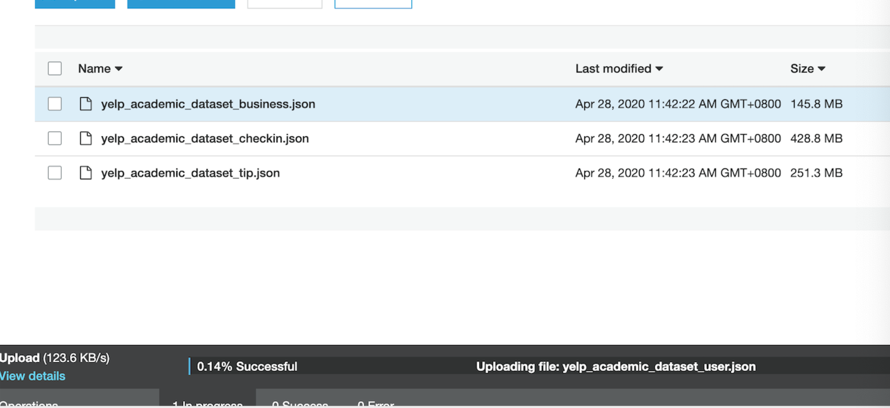
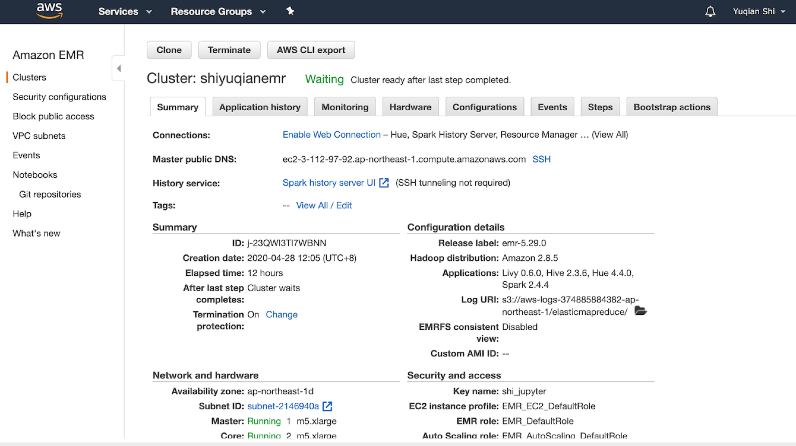
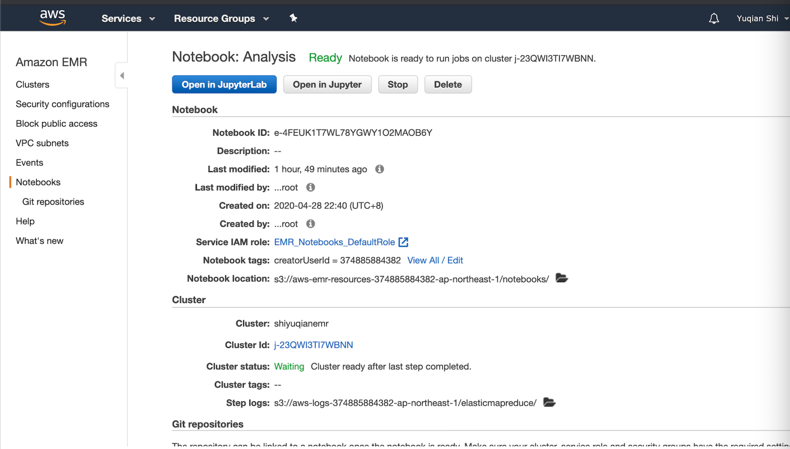

# report

### abstract

I made data cleaning processing and analysis according to the course requirements and promotion, and used pyspark, pandas, matplotlib to improve the task in combination with steps

### S3 URL：

s3://shiyuqianawsbucket/yelp_academic_dataset_business.json

s3://shiyuqianawsbucket/yelp_academic_dataset_checkin.json

s3://shiyuqianawsbucket/yelp_academic_dataset_review.json

s3://shiyuqianawsbucket/yelp_academic_dataset_tip.json

s3://shiyuqianawsbucket/yelp_academic_dataset_user.json

----

### screenshot

---

Cluster Configuration

Notebook Configuration

